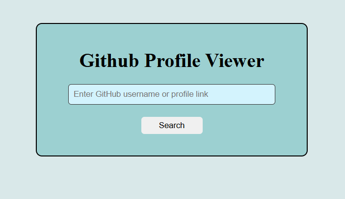

# GitHub Profile Viewer

A simple and responsive web app to search and view **GitHub user profiles** using the [GitHub REST API](https://docs.github.com/en/rest).

## 🚀 Features
- Search by **GitHub username** or full **profile link**
- Displays:
  - Profile picture
  - Name & username
  - Bio
  - Followers / Following
  - Public repositories count
  - Direct link to GitHub profile
- Error handling for invalid users or network issues
- Clean UI with basic styling

## 🖼️ Demo



## 🛠️ Tech Stack
- **HTML5**
- **CSS3**
- **JavaScript (Vanilla JS)**
- GitHub API

## 📦 Installation & Usage
1. Clone this repository:
   ```bash
   git clone https://github.com/Sneha28-p/github-profile-viewer.git
